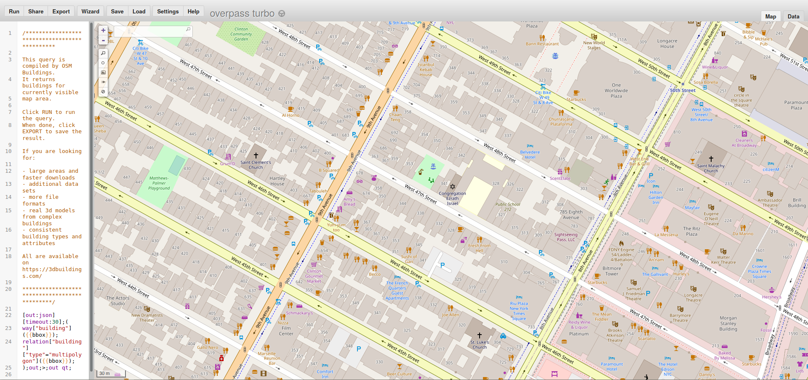
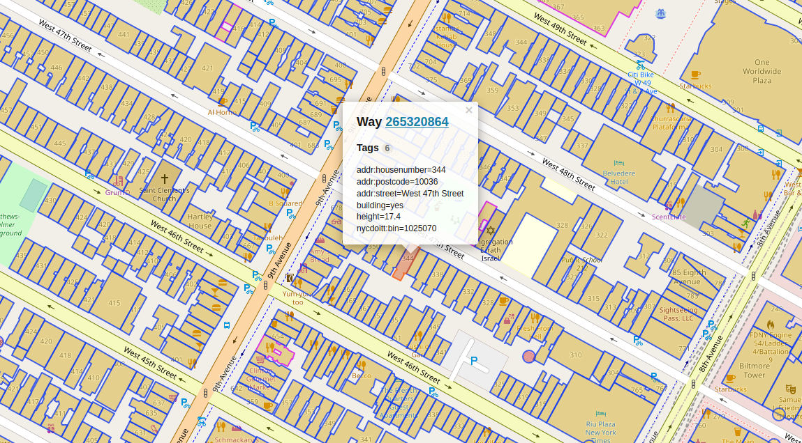
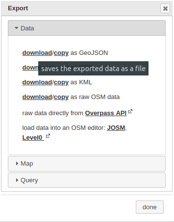
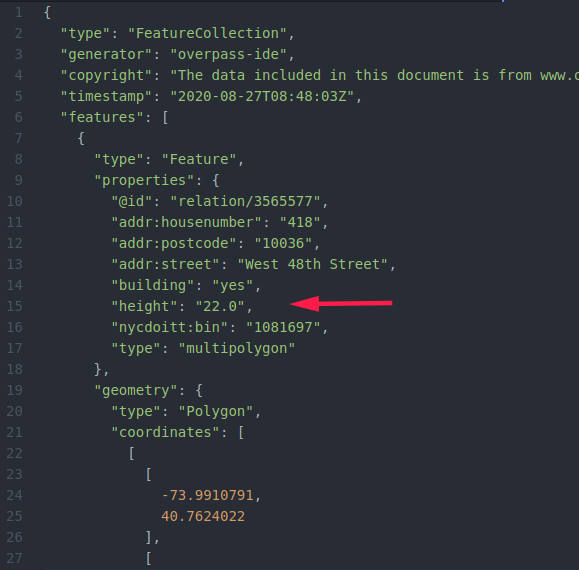

# Obtaining data files

## Description of the data

This project uses geographical data in order to construct the 3D model of the buildings and the ground.

In the examples, the ground is considered to be flat but it is still possible to build a custom ground surface using polygons.

The files contain a list of 2D polygons describing the rooftops and a height attribute for each of them.
Each building will be built by extruding its polygon from z=0 to z=height.

## Getting data with [overpass turbo](https://overpass-turbo.eu/)

A way to get data for free is to use OpenStreetMap's data.

After arriving on the website, you will be able to select the area of your interest using the window as the delimiting box.

Once the location is chosen, click on *Run*. After, all the buildings will by highlighted and you can obtain their information by clicking on them.

Data may differ from place to place and not all buildings have information about their height. If this is the case, you will be able to fix it manually after.

After, click on *Export* and choose *download as GeoJSON*.

Once its done, you should have a file with a content similar to what is shown hereunder. If the height attribute is missing, you can enter it manually for each polygon.

