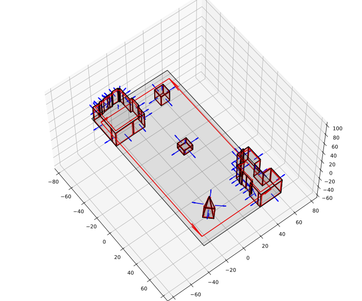
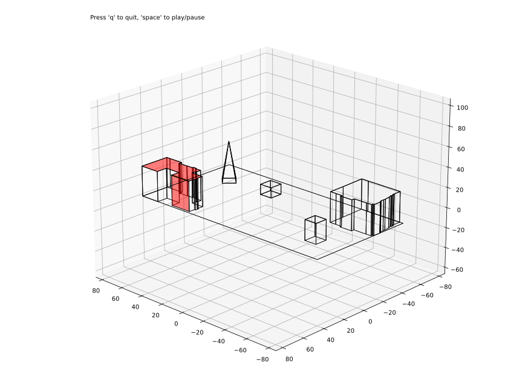
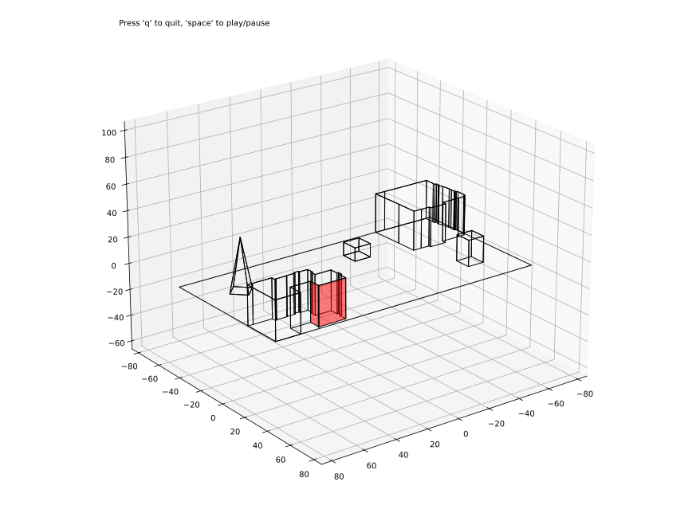
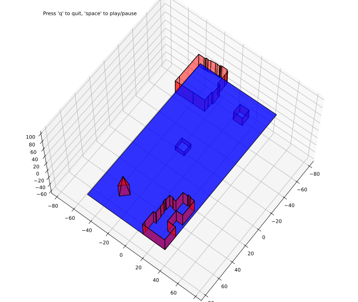
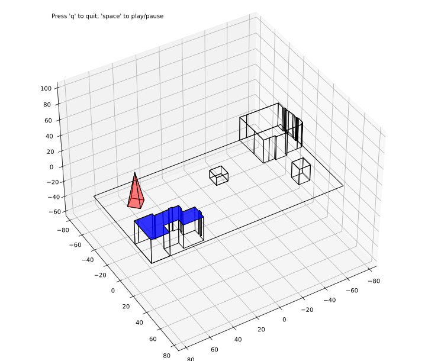
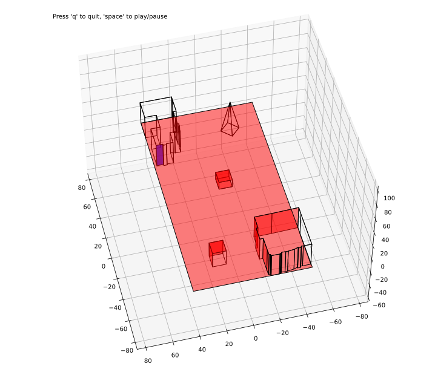

.. _Detailed Tutorial:

=================
Complete tutorial
=================

In this tutorial, you will be guided through each step required to build your own ray-tracing simulation.

Your study case will be the city of Louvain-la-Neuve, in Belgium.

.. contents:: Table of content

*************************
1. Building your geometry
*************************

1.A - Geometry from OpenStreetMap
#################################

Go to https://overpass-turbo.eu/, search for your location adapt the zoom in order to fit all the buildings you want in it.

Then, click on the **Execute** button. You should now see the buildings highlighted in blue.

Once it is done, you can **Export** and **Download as GeoJSON** the data.

.. literalinclude:: data/export.geojson
    :caption: First few lines of data file
    :language: JSON
    :lines: 1-30

Here, the data does not contain height information: this will manually added later.
In a few lines, you can plot your geometry (here called *place*) in 3D and visualize it.
Because it did not have any height attribute, we gave it a default value of 30 m.

.. code-block::
    :caption: Ploting raw data

    from raytracing import geometry as geom
    from raytracing import file_utils
    import matplotlib.pyplot as plt

    filename = 'export.geojson'
    place = geom.generate_place_from_rooftops_file(filename,
                                                   drop_missing_heights=False,
                                                   default_height=30)

    ax = place.plot3d(ret=True)
    place.center_3d_plot(ax)
    plt.show()

.. note::

    You will see that, by default, a ground surface is generated. Of course, this does not
    always reflect the real nature of the terrain. The :code:`place.surface` attribute can be
    modified to provide a better ground surface. Note that its normal should be be oriented
    upward.

1.B - Modify the geometry
#########################

As seen previously, you can obtain data from internet pretty easily. Nonetheless, this
data is not always meeting all the requirements and you may want to modify it. There are
three main ways to do so:

I. Before loading
*****************
Modify the content of the source file by modifying some features (i.e. buildings).
Here, only two buildings are kept:

II. With Python library
***********************

Use the Python library to manipulate the geometry, create new buildings, etc.

.. code-block::
    :caption: Adding some buildings to the geometry

    filename = 'export_modified.geojson'
    place = geom.generate_place_from_rooftops_file(filename,
                                                   drop_missing_heights=False,
                                                   default_height=30)

    import numpy as np
    # Place cube at center, height z = 20m and length L = 10m
    cube = geom.Cube.by_point_and_side_length(np.array([0, 0, 20]), 10)

    # Because I'm lazy, I take the bottom surface of the cube (always index 1)
    # as a square base

    square = cube.polygons[1]  # At [0, 0, 15]

    # Building
    building_base = square.translate(np.array([-60, 20, -15]))  # At [-60, 20, 0]
    building = geom.Building.by_polygon2d_and_height(building_base, 20)

    # Pyramid
    pyramid_base = square.translate(np.array([60, -20, -15]))

    # Will place the top of the pyramid in the middle of the base
    point = pyramid_base.get_centroid() + np.array([0, 0, 40])

    # Let's do fancy rotation

    from scipy.spatial.transform import Rotation
    matrix = Rotation.from_euler('z', 45, degrees=True).as_matrix()
    pyramid_base = pyramid_base.project(matrix.T, around_point=point)
    pyramid = geom.Pyramid.by_point_and_polygon(point, pyramid_base)

    place.polyhedra.extend([cube, building, pyramid])

III. In the geometry file
*************************

Modify the content of the geometry, after loading and saving it into as a .json. The
caveat of this method is that applying space transformation becomes very tedious as you
need to manually change all the points.

.. code-block::
    :caption: Saving geometry as JSON file

    place.to_json(filename='lln.json')

.. literalinclude:: data/lln.json
    :caption: First few lines of geometry file
    :language: JSON
    :lines: 1-30

1.C - Validate the geometry
###########################

Once the geometry is built, it is important to check that the internal properties of this
geometry are correct.

I. The orientation of each polygon
**********************************

As mentioned in the name of each class in the ``geometry.py`` file, geometrical objects are
oriented. It means that their normal vector should be pointing outward of the polyhedron
they are apart of. If a geometry is a surface or a polygon, its normal orientation should
be point upward (eg. ground surface).

You can verify that the orientation of correctly computed by plotting the geometry with
additional parameters.

.. code-block::
    :caption: Plot of the orientation of surfaces

    ax = place.plot3d(ret=True, poly_kwargs=dict(orientation=True, normal=True))

II. Detection of sharp edges
****************************

Diffraction only occurs on *sharp edges*. A sharp edge is considered to be an edge such
that the angle between the the polygon making this edge is bigger than a defined value.
This value should always be higher than zero, because diffraction can only occur on
convex angles. Nonetheless, it is possible to manually decide what you consider to be
a sharp edge.

.. code-block::
    :caption: Computation and plot of the geometry's sharp edges

    place.get_sharp_edges(min_angle=0)  # Only if you want to override default value
    place.show_sharp_edges_animation()

The plots below show, for each edge, the edge in green and the two adjacent polygons
in red.

III. Polygon visibility
***********************

Another really important thing in ray tracing is the polygon visibility. In order to find
paths between multiple points, it is mandatory to know on which surfaces the rays can
bounce. In 3D, this problem is *very complicated* and an attempt to give a solution to
this problem is given by the **visibility matrix**. For each polygon in the geometry,
the visibility matrix contains an indicator, for each other polygon, if it sees this polygon.
In order, if it is possible to drawn a line segment between those two polygons, without
intercepting any other polygon.

.. code-block::
    :caption: Generating the visibility matrix

    place.show_visibility_matrix_animation(strict=False)

***********************
2. Applying ray tracing
***********************

TODO